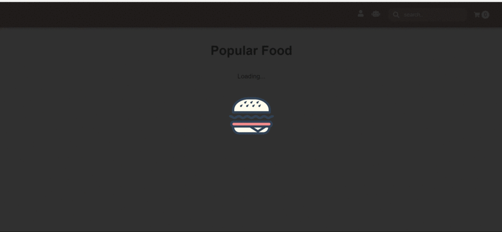

## React Food Delivery Web Application built using React-Redux-Axios
<br/>
<p align="center">
  
  
  
  
  
  <br/>
  
</p>

## [Demo](https://react-food-delivery.herokuapp.com/)

React Food Delivery app enables simplified responsive UI using react-redux combinations.


#### Features
- Skeleton Screen implementation before loading the products.
- Chat bot - helps user in fetching the best price available,calories counter etc..
- Filter products by Food Name.
- User Login and Address Forms with customized form validations.
- Add to cart,compute total price and display each food item details.
- Responsive Design suitable for all the devices.
- Fetch data from jsonurl's using Axios.

#### Technology Stack

- React 16.4.2
- Redux 4.0.0
- React Material
- CSS,HTML5
- [ChatBot](https://github.com/LucasBassetti/react-simple-chatbot)
- Axios - for promise HTTP requests

## Detailed Steps - Introduction

### Installation

Execute the following command -

npm install
```
npm start
```
Application starts running on `http://localhost:3000`

<br/>

### Copyright and license
The MIT License (MIT)


<br/>

<p align="center">
<sub>Thank you, Sai Prasanna Krishna</sub>
</p>
